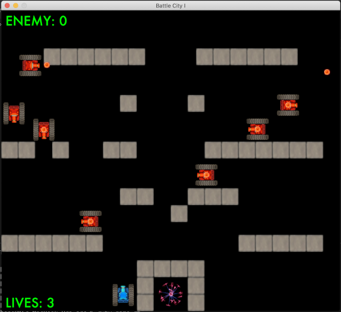

Battle City I is written using Ruby and Ruby Gosu library. It emulates an archade video game Battle City which was released in 1985. 

Before proceeding to download this game, please have Ruby 2.7.0 installed in your system at the time of the game release.

First download the game in the folder of your choice. Navigate into the src folder. Install bundler gem if you've not yet done so.
```
> gem install bundler
```
Next, install [Gosu gem](https://rubygems.org/gems/gosu/versions/0.10.8)
```
> bundle install
```
Run the game in src.
```
> Ruby game.rb
```

***
#### Game instructions
When the game starts, the player has 3 lives to fight against incoming enemy tanks. To win the game, the player must protect the "element" inside the castle so that it remains untouched. If it is destroyed, the player loses the game. The player must destroy all 50 enemy tanks. 

#### Keyboard control
Use arrow keys to navigate your tank. Press the space bar to launch a cannon blast. Press ESC to terminate the game and close the game window.

#### Acknowledgement
Explosion sounds: [Zapsplat](https://www.zapsplat.com/sound-effect-category/explosions/)

Tank assets: modified from [irmirx](https://opengameart.org/content/top-down-painted-tanks) CCBY3.0
